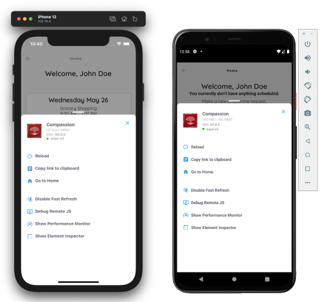

<div style="text-align:center">
  
</div>

# Compassion App

[](https://codecov.io/gl/compassion-in-oakland/compassionapp)

Compassion App is a [React Native](https://reactnative.dev/)/[Expo Framework](https://docs.expo.io/) application built with the [Ignite](https://github.com/infinitered/ignite) boilerplate. Please take a look at the documentation for Ignite to get familiar with its library choices, architecture, and development style.

## Setup

1. If using Windows, first enable the Windows Subsystem for Linux (WSL) [by following the guide here](https://docs.microsoft.com/en-us/windows/wsl/install-win10).

1. Install [nvm](https://github.com/nvm-sh/nvm) to manage Node versions. We'll use Node `v14.16.1` for this project.

   ```bash
   # After install:
   $ nvm install 14.16.1 && nvm alias default 14.16.1
   ```

1. Install simulators by [following the instructions here.](docs/simulator-setup.md)

1. Install `yarn`

   ```bash
   $ npm install -g yarn
   ```

1. Pull the repository

   ```bash
   $ git clone git@gitlab.com:compassion-in-oakland/compassionapp.git
   $ cd compassion app
   ```

1. Install project dependencies

   ```bash
   $ yarn install
   ```

1. Install [Expo CLI](https://docs.expo.io/workflow/expo-cli/) and log in

   ```bash
   # Install expo-cli
   $ npm install -g expo-cli

   # Log in -- create an account at https://expo.dev/signup if you haven't already
   $ expo login

   # Verify you're logged in
   $ expo whoami
   ```

1. (Optional) Install [Reactotron](https://github.com/infinitered/reactotron)

   ```bash
   # Install reactotron (macOS)
   $ brew install reactotron
   ```

Also, you might want to check out [Editor Setup](docs/editor-setup.md) if using VS Code for the first time for a Typescript project.

...aaand you're set!

## Development

The development process is usually: open Metro --> launch the simulator of your choice --> start development.

```bash
# Opens the Metro bundler
$ yarn start
# Either on the command line or on the web interface, select a simulator (iOS or Android) to connect to.
# Wait for Expo to be installed on your simulator image and then for Expo to build and publish the bundle to the virtual device

# (Optionally) Open Reactotron to inspect the app, similar to Redux Dev Tools

# In another terminal instance, run the following to get live feedback about Typescript errors
$ yarn compile --watch

# Similarly, you can keep a watch process for unit tests
$ yarn test --watch
```

### Debugging

Occasionally, you'll have to open [the Expo developer menu](https://docs.expo.io/workflow/development-mode/#showing-the-developer-menu) to reload the app or to debug issues. To activate the menu, use the following keyboard shortcuts:

- For iOS simulators, press <kbd>Ctrl</kbd>+<kbd>Cmd</kbd>+<kbd>z</kbd>
- For Android simulators, press <kbd>Cmd</kbd>+<kbd>m</kbd>



What's very useful from this menu is the **Element Inspector**, which acts similar to Chrome's DevTools for inspecting the bounds and attributes of UI elements.

## Testing

### Unit Tests

```bash
# Run unit tests
$ yarn test

# Update Jest Snapshots
$ yarn test -u
```

### Storybook

Storybook in React Native works a little bit differently than with a web-based React app.

First, you'll need to start Storybook, which will build the project and launch the Storybook viewer on https://localhost:9001:

```bash
$ yarn storybook
```

Then add this line in `./storybook/toggle-storybook.tsx`:

```ts
saveString("devStorybook", "on")
```

When you reload your app, your simulator will render the story and will respond to changes as you select different stories on the browser.

### End-to-end Testing with Detox

[Detox](https://github.com/wix/Detox) is a test automation library for writing and driving E2E tests against the app. This library comes with the Ignite boilerplate and doesn't appear to have many tests initially, but it'll be useful later when we need to program specific behaviors and user flows for verification in CI.

## Other Docs

- [Deployments and Distribution](docs/deployments-distribution.md)
- [Firestore Structure](docs/firebase-schema.md)
- [Types and Schemas](docs/types-schemas.md)
- [Ignite's original README](docs/ignite-readme.md)

## Resources

Below are recommended resources to reference and read about when working with the app.

- **[react-navigation's guide on nested navigators](https://reactnavigation.org/docs/nesting-navigators/)**
  This is a great guide to explain the difference between browser-based navigation (via manipulating route parameters in the URL) and the _stack navigator_ which is what most mobile apps employ.
